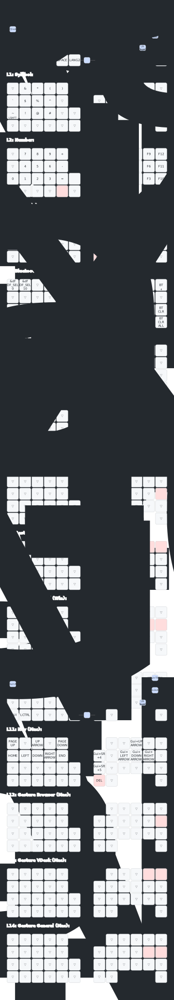

# moNa2 v2 ZMK Config

右手トラックボール付き分割キーボード「moNa2」のZMKファームウェア設定。

- ボード: Seeeduino XIAO BLE
- センサ: PMW3610（右手側）
- ファームウェア: ZMK v0.3.0

---

## レイヤー一覧

| # | レイヤー名 | 概要 | LED |
|---|-----------|------|-----|
| 0 | Default (Win) | QWERTY基本配置 | ⚫ 消灯 |
| 1 | Symbol | 記号・括弧 | 🟡 黄 |
| 2 | Number | 数字・ファンクション | 🔵 青 |
| 3 | Nav (Win) | ナビゲーション | 🩵 シアン |
| 4 | BT | Bluetooth設定 | 🔴 赤 |
| 5 | Mouse | マウスボタン（Automouseで自動遷移） | 🟣 マゼンタ |
| 6 | Scroll | スクロールモード | ⚪ 白 |
| 7 | Gesture L7 | ジェスチャー：ブラウザ操作 | — |
| 8 | Gesture L8 | ジェスチャー：仮想デスクトップ | — |
| 9 | Gesture L9 | ジェスチャー：一般操作 | — |
| 10 | Default (Mac) | Mac用ベースレイヤー（L0透過オーバーレイ） | 🟢 緑 |
| 11 | Nav Mac | Macナビゲーション ≒ L3のMac版（スクリーンショットのみ差替） | 🩵 シアン |
| 12 | Gesture Mac L7 | Macジェスチャー ≒ L7のMac版（Cmd+T/W でタブ操作） | — |
| 13 | Gesture Mac L8 | Macジェスチャー ≒ L8のMac版（Ctrl+←→ でSpace切替） | — |
| 14 | Gesture Mac L9 | Macジェスチャー ≒ L9のMac版（Spotlight・ウィンドウ切替） | — |

## キーマップ



---

## レイヤー遷移図

```mermaid
flowchart LR
    classDef winBase fill:#607D8B,stroke:#37474F,color:#fff
    classDef macBase fill:#43A047,stroke:#2E7D32,color:#fff
    classDef symbol  fill:#F9A825,stroke:#c47d00,color:#fff
    classDef number  fill:#1976D2,stroke:#1565C0,color:#fff
    classDef nav     fill:#0097A7,stroke:#006064,color:#fff
    classDef bt      fill:#E53935,stroke:#B71C1C,color:#fff
    classDef mouse   fill:#E91E63,stroke:#880E4F,color:#fff
    classDef scroll  fill:#78909C,stroke:#546E7A,color:#fff
    classDef gesture fill:#7B1FA2,stroke:#4A148C,color:#fff

    L0["L0\nDefault\nWin\n⚫"]:::winBase
    L10["L10\nDefault\nMac\n🟢\n※L0と同時にアクティブ"]:::macBase
    L4["L4\nBluetooth\n🔴"]:::bt
    L1["L1\nSymbol\n🟡"]:::symbol
    L2["L2\nNumber\n🔵"]:::number
    L3["L3\nNav Win\n🩵"]:::nav
    L11["L11\nNav Mac\n🩵"]:::nav
    L12["L12\nGesture Mac\nBrowser"]:::gesture
    L13["L13\nGesture Mac\nVDesk"]:::gesture
    L14["L14\nGesture Mac\nGeneral"]:::gesture
    L5["L5\nMouse\n🟣"]:::mouse
    L6["L6\nScroll\n⚪"]:::scroll
    L7["L7\nGesture\nBrowser"]:::gesture
    L8["L8\nGesture\nVDesk"]:::gesture
    L9["L9\nGesture\nGeneral"]:::gesture

    %% BT切替
    L0 <-->|"combo LANG2+LANG1\nQ=Win / W=Mac"| L4
    L10 <-->|"combo LANG2+LANG1\nQ=Win / W=Mac"| L4

    %% L0からの遷移（Win・Mac共通）
    L0 -->|"ENTER"| L1
    L0 -->|"SPACE"| L2
    L0 -->|"LANG1"| L3
    L0 -->|"TAB / ESC"| L5
    L0 -->|"combo ,."|  L6
    L0 -->|"−"| L7
    L0 -->|"combo 8+9"| L8
    L0 -->|"combo 19+20"| L9
    L0 -->|"🖱️ Automouse"| L5

    %% 戻り
    L1 & L2 & L3 & L7 & L8 & L9 -->|"キー離す"| L0
    L6 -->|"combo ,. 再押し"| L0
    L5 -->|"10秒 or Ctrl/Shift"| L0

    %% L10はL0と同時にアクティブ → L0の全遷移が使える
    L10 <-.->|"常時重ねがけ\n（L0透過）"| L0

    %% L10のみ異なる遷移
    L10 -->|"LANG1"| L11
    L10 -->|"−"| L12
    L10 -->|"combo 8+9"| L13
    L10 -->|"combo 19+20"| L14
    L11 -->|"キー離す"| L10
    L12 & L13 & L14 -->|"キー離す"| L10
```

### 補足

- **Win モード**（デフォルト）: Layer 0 を基点に遷移
- **Mac モード**: Layer 10 を基点に遷移。Layer 10 は Layer 0 の透過オーバーレイ（LANG1 長押し以外は Layer 0 に通過）
- **Automouse**: トラックボールを動かすと Layer 5 に自動遷移、300ms 静止 + 10秒タイムアウトで復帰
- **BT プロファイルごとに Win/Mac 設定を記憶**（Flash 保存）

---

## 特殊バインド

- `A` ホールド → **Win: LCtrl** / **Mac: Cmd**（+ マウスレイヤー終了）
- `Z` ホールド → LShift（+ マウスレイヤー終了）
- `LANG1` タップ → Layer 0へ戻る / ホールド → Layer 3一時有効（Mac時はLayer 11）

---

## Layer 2 - Number

**エンコーダ:** 上下スクロール

---

## Layer 3/11 - Nav（ナビゲーション）

| 機能 | Windows (L3) | Mac (L11) |
|------|-------------|-----------|
| 全画面スクショ | `Ctrl+Win+PrintScreen` | `Cmd+Shift+4` |
| 範囲スクショ | `Shift+PrintScreen` | `Cmd+Shift+5`（スクショメニュー） |
| ウィンドウスナップ | `Win+↑/←/↓/→` | `Cmd+↑/←/↓/→`（⚠️ Mac未対応） |

> **Mac 注意:** `Cmd+矢印` はテキストナビゲーション（行末・先頭等）として機能し、ウィンドウスナップにはなりません。Rectangle 等のアプリでショートカットを `Cmd+矢印` に割り当てれば利用可能です。

**エンコーダ:** `Cmd+Shift+]` / `Cmd+Shift+[`（タブ切り替え、Safari/Chrome/Firefox 対応）

**トラックボール:** スクロール変換（X軸反転、速度1/5倍）

---

## Layer 5 - Mouse（マウス操作）

トラックボール操作で自動遷移（Automouse）。

| ボタン | 機能 |
|--------|------|
| MB1 | 左クリック |
| MB2 | 右クリック |
| MB3 | 中クリック |
| MB4 | 戻る |
| MB5 | 進む |

---

## Layer 6 - Scroll（スクロール）

全キー透過（トランス）。トラックボール移動がスクロール入力に変換される。

**遷移方法:** `,` + `.` 同時押し（トグル）

- スケール: 1/8倍
- Y軸反転あり

---

## Layer 7/12 - Gesture（ブラウザ操作）

トラックボールのスワイプ方向でブラウザ操作。

| スワイプ | 動作 | Windows (L7) | Mac (L12) |
|---------|------|-------------|-----------|
| ←      | 前のタブ | `Ctrl+Shift+Tab` | `Ctrl+Shift+Tab` |
| →      | 次のタブ | `Ctrl+Tab` | `Ctrl+Tab` |
| ↑      | 新規タブ | `Ctrl+T` | `Cmd+T` |
| ↓      | タブを閉じる | `Ctrl+W` | `Cmd+W` |

**遷移方法:** `-`キー長押し または コンボ（後述）

---

## Layer 8/13 - Gesture（仮想デスクトップ）

| スワイプ | Windows 動作 (L8) | ショートカット | Mac 動作 (L13) | ショートカット |
|---------|-----------------|--------------|--------------|--------------|
| ←      | 前の仮想デスク | `Win+Ctrl+←` | 前のSpace | `Ctrl+←` |
| →      | 次の仮想デスク | `Win+Ctrl+→` | 次のSpace | `Ctrl+→` |
| ↑      | タスクビュー | `Win+Tab` | Mission Control | `Ctrl+↑` |
| ↓      | アプリを次のデスクへ | `Win+Ctrl+Shift+→` | Spaceへ移動 | `Ctrl+Shift+→` |

**遷移方法:** キー8+9同時押し（Win: `Alt+Tab` / Mac: `Cmd+Tab`）

---

## Layer 9/14 - Gesture（一般操作）

| スワイプ | Windows 動作 (L9) | ショートカット | Mac 動作 (L14) | ショートカット |
|---------|-----------------|--------------|--------------|--------------|
| ↑      | URLバー選択 | `Ctrl+L` | URLバー選択 | `Cmd+L` |
| ↓      | スクリーンショット | `Win+S` | Spotlight / Raycast | `Cmd+Space` |
| ←      | （前のウィンドウ） | `←` | （前のウィンドウ） | `←` |
| →      | Windows Terminal起動 | `Win+T` | 同アプリ内ウィンドウ切替 | `Cmd+\`` |

**遷移方法:** キー19+20同時押し（Win: `Win` / Mac: `Cmd`）

---

## Layer 10 - Default Mac（差分）

- `-` キー ホールド → Layer 12（Mac Gesture L7）
- `LANG1` ホールド → Layer 11（Mac Nav）
- コンボ `8+9` → Layer 13（Mac Gesture L8）
- コンボ `19+20` → Layer 14（Mac Gesture L9）

---

## コンボ

| キー | 動作 |
|-----|------|
| `O` + `P` 同時押し | Layer 8 一時有効 + `Alt+Tab` |
| `L` + `-` 同時押し | Layer 9 一時有効 + `Win` |
| `LANG2` + `LANG1` 同時押し | Layer 4 (Bluetooth) 一時有効 |
| `,` + `.` 同時押し | Layer 6 (Scroll) トグル ON/OFF |
| `Q` + `A` 同時押し | 全選択（Win: `Ctrl+A` / Mac: `Cmd+A`） |

---

## Automouse設定

トラックボールを動かすと自動的にマウスレイヤー(5)に遷移する。

| 項目 | 値 |
|-----|-----|
| 対象レイヤー | Layer 5（Mouse） |
| タイムアウト | 10000ms（10秒） |
| require-prior-idle | 300ms（静止300ms後の操作で発動） |
| 除外キー位置 | `10 17 18 19 21 29 31` |

---

## トラックボール（PMW3610）設定

| 項目 | 値 |
|-----|-----|
| CPI | 600 |
| invert-x | 有効（COROPIT版） |
| force-awake | 有効 |
| SPI周波数 | 2MHz |

### レイヤー別トラックボール挙動

| レイヤー | 挙動 | スケール |
|---------|------|---------|
| 0〜2, 4, 5 | マウス移動 | 等倍（Automouseトリガー付き） |
| 2 | マウス移動 | 1/3倍（低速） |
| 3 | スクロール（X反転） | 1/5倍 |
| 6 | スクロール（Y反転） | 1/8倍 |
| 7〜9 | ジェスチャー認識 | — |

---

## ジェスチャー設定（共通）

| 項目 | 値 |
|-----|-----|
| stroke-size | 5 |
| movement-threshold | 6 |
| idle-timeout | 100ms |
| gesture-cooldown | 120ms |
| eager-mode | 有効 |

---

## エンコーダ設定

| レイヤー | 動作 |
|---------|------|
| 0, 1, 4, 5, 6 | 上下スクロール |
| 2 | 上下スクロール |
| 3 (Win Nav) | `Ctrl+Tab` / `Ctrl+Shift+Tab` |
| 11 (Mac Nav) | `Cmd+Shift+]` / `Cmd+Shift+[` |

---

## Bluetooth設定

Layer 4で操作。

| キー | 機能 |
|-----|------|
| BT_0〜4 | デバイス0〜4を選択 |
| BT_CLR | 現在のBTペアリング解除 |
| BT_CLR_ALL | 全ペアリング解除 |
| BOOT | ブートローダモード |

---

## 使用モジュール

| モジュール | 用途 | 作者 |
|-----------|------|------|
| zmk-pmw3610-driver | PMW3610センサドライバ | badjeff |
| zmk-rgbled-widget | RGB LED表示 | caksoylar |
| zmk-input-processor-keybind | 入力プロセッサ | zettaface |
| zmk-mouse-gesture | マウスジェスチャー認識 | kot149 |
| zmk-listeners | レイヤーリスナー | ssbb |

---

## COROPIT版での設定変更

`boards/shields/mona2/mona2_r.overlay` を以下のように修正：

**修正前（デフォルト）:**
```c
cpi = <600>;
//swap-xy;
//invert-x;
//invert-y;
```

**修正後（COROPIT版）:**
```c
cpi = <600>;
//swap-xy;
invert-x;
invert-y;
```
