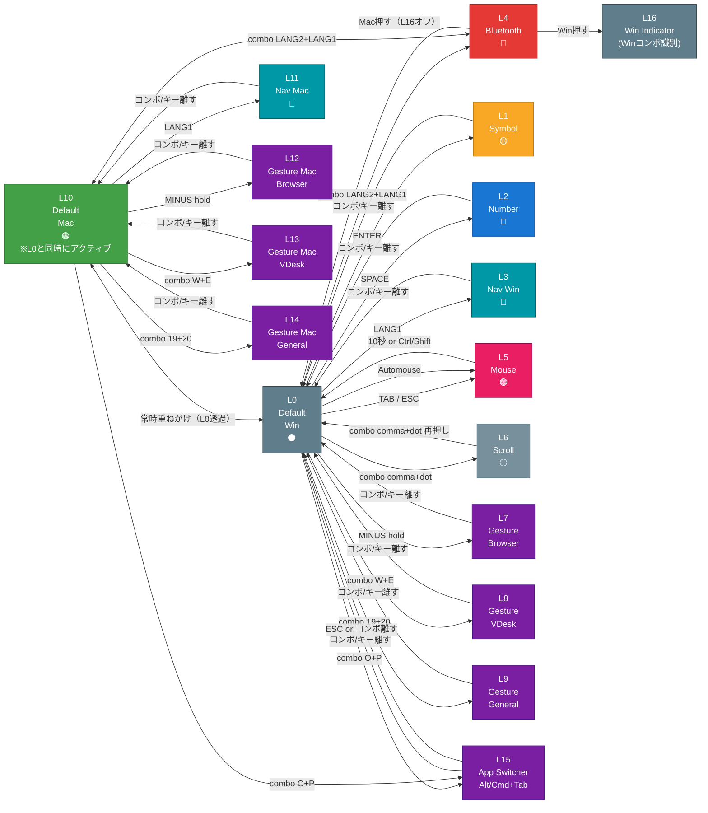

# moNa2 v2 ZMK Config

右手トラックボール付き分割キーボード「moNa2」のZMKファームウェア設定。

- ボード: Seeeduino XIAO BLE
- センサ: PMW3610（右手側）
- ファームウェア: ZMK v0.3.0

---

## レイヤー一覧

| # | レイヤー名 | 概要 | LED | 起動方法 |
|---|-----------|------|-----|---------|
| 0 | Default (Win) | QWERTY基本配置 | ⚫ 消灯 | ベースレイヤー（常時） |
| 1 | Symbol | 記号・括弧 | 🟡 黄 | `ENTER` ホールド |
| 2 | Number | 数字・ファンクション | 🔵 青 | `SPACE` ホールド |
| 3 | Nav (Win) | ナビゲーション + ウィンドウスナップ | 🩵 シアン | `LANG1` ホールド |
| 4 | BT | Bluetooth設定 + 現在プロファイルのWin/Mac設定 | 🔴 赤 | `LANG2`+`LANG1` 同時押し |
| 5 | Mouse | マウスボタン | 🟣 マゼンタ | `TAB` or `ESC` ホールド / Automouse |
| 6 | Scroll | スクロールモード | ⚪ 白 | `,`+`.` 同時押し（トグル） |
| 7 | Gesture L7 | ジェスチャー：ブラウザ操作 | — | `-` ホールド（Win） |
| 8 | Gesture L8 | ジェスチャー：仮想デスクトップ | — | `W`+`E` 同時押し（Win） |
| 9 | Gesture L9 | ジェスチャー：一般操作 | — | `L`+`-` 同時押し（Win） |
| 10 | Default (Mac) | Mac用ベースレイヤー（L0透過オーバーレイ） | 🟢 緑 | L4で `BTn` 選択後 `Mac` を保存 |
| 11 | Nav Mac | Magnetウィンドウスナップ（3×3）+ Macナビゲーション | 🩵 シアン | `LANG1` ホールド（Mac） |
| 12 | Gesture Mac L7 | Macジェスチャー：ブラウザ操作 | — | `-` ホールド（Mac） |
| 13 | Gesture Mac L8 | Macジェスチャー：仮想デスクトップ | — | `W`+`E` 同時押し（Mac） |
| 14 | Gesture Mac L9 | Macジェスチャー：一般操作 | — | `L`+`-` 同時押し（Mac） |
| 15 | App Switcher | Alt/Cmd+Tab アプリ切替 | — | `O`+`P` 同時押し（Win/Mac共通） |
| 16 | Win Indicator | Winモードコンボ識別用フラグ（全キー透過） | — | Winモード時に自動オン |

## キーマップ


---

## レイヤー遷移図



### 補足

- **Win モード**（デフォルト）: Layer 0 を基点に遷移。Layer 16 (Win Indicator) が同時アクティブ
- **Mac モード**: Layer 10 を基点に遷移。Layer 10 は Layer 0 の透過オーバーレイ（LANG1 長押し以外は Layer 0 に通過）
- **Layer 16 (Win Indicator)**: Layer 0 は常時アクティブなため「Winモード限定コンボ」を `layers=0` で定義するとMacモードでも誤発火する。Layer 16 をWinモードのフラグとして使い、Winコンボは `layers=16` で参照することで誤発火を防ぐ
- **Automouse**: トラックボールを動かすと Layer 5 に自動遷移、300ms 静止 + 10秒タイムアウトで復帰
- **BT プロファイルごとに Win/Mac 状態をキーボード側へ保存**
- **LED は最上位レイヤー色を表示する。L4 を押している間は常に赤で、離した後に Win=消灯 / Mac=緑 を確認する**

---

## 特殊バインド

- `A` ホールド → **Win: LCtrl** / **Mac: Cmd**（+ マウスレイヤー終了）
- `Z` ホールド → LShift（+ マウスレイヤー終了）
- `LANG1` タップ → Layer 0へ戻る / ホールド → Layer 3一時有効（Mac時はLayer 11）

---

## Layer 2 - Number

**エンコーダ:** 上下スクロール

---

## Layer 3/11 - Nav（ナビゲーション）

左側はカーソル移動、右側はウィンドウスナップ（3×3空間マッピング）。
Win/Mac で同一の `Ctrl+Alt+[key]` を送信し、OS側ソフトウェアが処理する。

```
LANG1押しながら...

[ Y ] [ U ] [ I ] [ O ] [ P ]
 左2/3  左上  上半  右上  右2/3

[ H ] [ J ] [ K ] [ L ] [ - ]
 左1/3  左半  最大  右半  右1/3

[ N ] [ M ] [ , ] [ . ] [ / ]
 復元  左下  下半  右下  中央1/3
```

| 機能 | Windows (L3) | Mac (L11) |
|------|-------------|-----------|
| ウィンドウスナップ | `Ctrl+Alt+[key]` → **AHK**（`windows/window_snap.ahk`） | `Ctrl+Alt+[key]` → **Magnet** |
| 全画面スクショ | `Ctrl+Win+PrintScreen` | `Cmd+Shift+4` |
| 範囲スクショ | `Shift+PrintScreen` | `Cmd+Shift+5` |
| **Ctrl+Alt+Del** | `LANG1+BS`（ロック画面解除） | — |

**エンコーダ:**
- Win (L3): `Ctrl+Tab` / `Ctrl+Shift+Tab`（タブ切り替え）
- Mac (L11): `Cmd+Shift+]` / `Cmd+Shift+[`（タブ切り替え）

**トラックボール:** スクロール変換（X軸反転、速度1/5倍）

---

## Layer 5 - Mouse（マウス操作）

トラックボール操作で自動遷移（Automouse）。

| ボタン | 機能 |
|--------|------|
| MB1 | 左クリック |
| MB2 | 右クリック |
| MB3 | 中クリック |
| MB4 | 戻る |
| MB5 | 進む |

---

## Layer 6 - Scroll（スクロール）

全キー透過（トランス）。トラックボール移動がスクロール入力に変換される。

**遷移方法:** `,` + `.` 同時押し（トグル）

- スケール: 1/8倍
- Y軸反転あり

---

## Layer 7/12 - Gesture（ブラウザ操作）

トラックボールのスワイプ方向でブラウザ操作。

| スワイプ | 動作 | Windows (L7) | Mac (L12) |
|---------|------|-------------|-----------|
| ←      | 前のタブ | `Ctrl+Shift+Tab` | `Ctrl+Shift+Tab` |
| →      | 次のタブ | `Ctrl+Tab` | `Ctrl+Tab` |
| ↑      | 新規タブ | `Ctrl+T` | `Cmd+T` |
| ↓      | タブを閉じる | `Ctrl+W` | `Cmd+W` |

**遷移方法:** `-`キー長押し または コンボ（後述）

**エンコーダ:**
- Win (L7): `Ctrl+-` / `Ctrl+=`（ズーム）
- Mac (L12): `Cmd+-` / `Cmd+=`（ズーム）

---

## Layer 8/13 - Gesture（仮想デスクトップ）

| スワイプ | Windows 動作 (L8) | ショートカット | Mac 動作 (L13) | ショートカット |
|---------|-----------------|--------------|--------------|--------------|
| ←      | 前の仮想デスク | `Win+Ctrl+←` | 前のSpace | `Ctrl+←` |
| →      | 次の仮想デスク | `Win+Ctrl+→` | 次のSpace | `Ctrl+→` |
| ↑      | タスクビュー | `Win+Tab` | Mission Control | `Ctrl+↑` |
| ↓      | アプリを次のデスクへ | `Win+Ctrl+Shift+→` | Spaceへ移動 | `Ctrl+Shift+→` |

**遷移方法:** `W`+`E` 同時押し

---

## Layer 9/14 - Gesture（一般操作）

| スワイプ | Windows 動作 (L9) | ショートカット | Mac 動作 (L14) | ショートカット |
|---------|-----------------|--------------|--------------|--------------|
| ↑      | URLバー選択 | `Ctrl+L` | URLバー選択 | `Cmd+L` |
| ↓      | PowerToys Run | `Alt+Space` | Spotlight / Raycast | `Cmd+Space` |
| ←      | ブラウザ戻る | `Alt+←` | ブラウザ戻る | `Cmd+←` |
| →      | ブラウザ進む | `Alt+→` | ブラウザ進む | `Cmd+→` |

**遷移方法:** キー19+20同時押し（Win: `Win` / Mac: `Cmd`）

---

## Layer 10 - Default Mac（差分）

- `-` キー ホールド → Layer 12（Mac Gesture L7）
- `LANG1` ホールド → Layer 11（Mac Nav）
- コンボ `8+9` → Layer 13（Mac Gesture L8）
- コンボ `19+20` → Layer 14（Mac Gesture L9）

---

## コンボ

| キー | 動作 |
|-----|------|
| `W` + `E` 同時押し | Layer 8/13 一時有効（仮想デスクトップジェスチャー） |
| `O` + `P` 同時押し | Layer 15 一時有効（App Switcher、Alt/Cmd+Tab） |
| `L` + `-` 同時押し | Layer 9/14 一時有効（一般ジェスチャー + Win/Cmd） |
| `LANG2` + `LANG1` 同時押し | Layer 4 (Bluetooth) 一時有効 |
| `,` + `.` 同時押し | Layer 6 (Scroll) トグル ON/OFF |
| `Q` + `A` 同時押し | 全選択（Win: `Ctrl+A` / Mac: `Cmd+A`） |

### Layer 4 の使い方

- 上段右側 5 キー: `BT0..4`
- 左上側: `Win`
- その右: `Mac`
- `bootloader`: ブートローダ起動
- `BT CLR` / `BT CLR ALL`: 現在のプロファイル消去 / 全消去
- 手順: `BTn` を押す → `Win` または `Mac` を押す

### Win/Mac 判定の見方

- `Win`: Layer 10 がオフなので、L4 を離した後は LED が消灯
- `Mac`: Layer 10 がオンなので、L4 を離した後は LED が緑
- `L4` を押している間は Layer 4 が最上位なので赤
- `Nav Mac` に入ると Layer 11 が最上位になり、LED はシアンに変わる

---

## Automouse設定

トラックボールを動かすと自動的にマウスレイヤー(5)に遷移する。

| 項目 | 値 |
|-----|-----|
| 対象レイヤー | Layer 5（Mouse） |
| タイムアウト | 10000ms（10秒） |
| require-prior-idle | 300ms（静止300ms後の操作で発動） |
| 除外キー位置 | `10 17 18 19 21 29 31` |

---

## トラックボール（PMW3610）設定

| 項目 | 値 |
|-----|-----|
| CPI | 600 |
| invert-x | 有効（COROPIT版） |
| force-awake | 有効 |
| SPI周波数 | 2MHz |

### レイヤー別トラックボール挙動

| レイヤー | 挙動 | スケール |
|---------|------|---------|
| 0〜2, 4, 5 | マウス移動 | 等倍（Automouseトリガー付き） |
| 2 | マウス移動 | 1/3倍（低速） |
| 3 | スクロール（X反転） | 1/5倍 |
| 6 | スクロール（Y反転） | 1/8倍 |
| 7〜9 | ジェスチャー認識 | — |

---

## ジェスチャー設定（共通）

| 項目 | 値 |
|-----|-----|
| stroke-size | 5 |
| movement-threshold | 6 |
| idle-timeout | 100ms |
| gesture-cooldown | 120ms |
| eager-mode | 有効 |

---

## エンコーダ設定

| レイヤー | 動作 |
|---------|------|
| 0, 1, 2, 4, 5, 6, 10, 16 | 上下スクロール |
| 3 (Win Nav) | `Ctrl+Tab` / `Ctrl+Shift+Tab` |
| 7 (Win Gesture Browser) | `Ctrl+-` / `Ctrl+=` |
| 8 (Win Gesture VDesk) | `Win+Ctrl+←` / `Win+Ctrl+→` |
| 9 (Win Gesture General) | `Alt+←` / `Alt+→` |
| 11 (Mac Nav) | `Cmd+Shift+]` / `Cmd+Shift+[` |
| 12 (Mac Gesture Browser) | `Cmd+-` / `Cmd+=` |
| 13 (Mac Gesture VDesk) | `Ctrl+←` / `Ctrl+→` |
| 14 (Mac Gesture General) | `Cmd+←` / `Cmd+→` |
| 15 (App Switcher) | `Shift+Tab` / `Tab` |

---

## Bluetooth設定

Layer 4で操作。

| キー | 機能 |
|-----|------|
| BT_0〜4 | デバイス0〜4を選択 |
| BT_CLR | 現在のBTペアリング解除 |
| BT_CLR_ALL | 全ペアリング解除 |
| BOOT | ブートローダモード |

---

## 使用モジュール

| モジュール | 用途 | 作者 |
|-----------|------|------|
| zmk-pmw3610-driver | PMW3610センサドライバ | badjeff |
| zmk-rgbled-widget | RGB LED表示 | caksoylar |
| zmk-input-processor-keybind | 入力プロセッサ | zettaface |
| zmk-mouse-gesture | マウスジェスチャー認識 | kot149 |
| zmk-listeners | レイヤーリスナー | ssbb |

---

## COROPIT版での設定変更

`boards/shields/mona2/mona2_r.overlay` を以下のように修正：

**修正前（デフォルト）:**
```c
cpi = <600>;
//swap-xy;
//invert-x;
//invert-y;
```

**修正後（COROPIT版）:**
```c
cpi = <600>;
//swap-xy;
invert-x;
invert-y;
```
