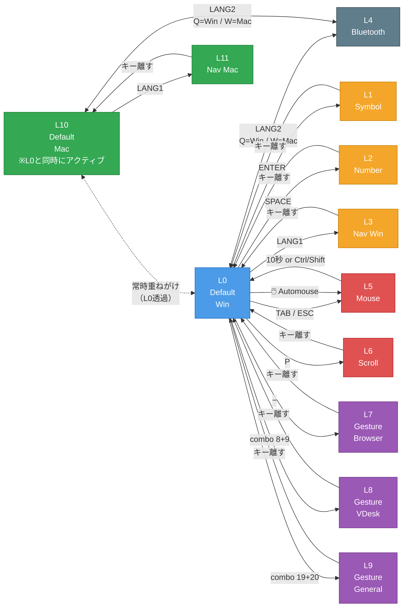

# moNa2 v2 ZMK Config

右手トラックボール付き分割キーボード「moNa2」のZMKファームウェア設定。

- ボード: Seeeduino XIAO BLE
- センサ: PMW3610（右手側）
- ファームウェア: ZMK v0.3.0

---

## キー配置図

```
左手側                                右手側
 0   1   2   3   4                    5   6   7   8   9
10  11  12  13  14  15              16  17  18  19  20
21  22  23  24  25  26  27      28  29  30  31  32  33
34  35  36  37  38  39  40      41  42  43
```

---

## レイヤー遷移図



### 補足

- **Win モード**（デフォルト）: Layer 0 を基点に遷移
- **Mac モード**: Layer 10 を基点に遷移。Layer 10 は Layer 0 の透過オーバーレイ（LANG1 長押し以外は Layer 0 に通過）
- **Automouse**: トラックボールを動かすと Layer 5 に自動遷移、300ms 静止 + 10秒タイムアウトで復帰
- **BT プロファイルごとに Win/Mac 設定を記憶**（Flash 保存）

---

## レイヤー一覧

| # | レイヤー名 | 概要 |
|---|-----------|------|
| 0 | Default | QWERTY基本配置 |
| 1 | Symbol | 記号・括弧 |
| 2 | Number | 数字・ファンクション |
| 3 | Nav | ナビゲーション |
| 4 | BT | Bluetooth設定 |
| 5 | Mouse | マウスボタン（Automouseで自動遷移） |
| 6 | Scroll | スクロールモード |
| 7 | Gesture L7 | ジェスチャー：ブラウザ操作 |
| 8 | Gesture L8 | ジェスチャー：仮想デスクトップ |
| 9 | Gesture L9 | ジェスチャー：一般操作 |

---

## Layer 0 - Default（QWERTY）

```
Q       W       E       R       T               Y       U       I       O       P [hold:SCROLL]
A       S       D       F       G       ;       H       J       K       L       - [hold:Gesture_L7]
[hold:LCTRL]            [hold:LSHIFT]
Z       X       C       V       B   TAB[hold:5]  "       N       M       ,       .       / [hold:RSHFT]

LCTRL  LWIN  LALT  LANG2  SPC[hold:2]  LANG1[hold:3]     BS   ENTER[hold:1]  ESC[hold:5]
       [hold:4]    [hold:3→L0]
```

**特殊バインド:**
- `A`キー左Ctrl長押し → マウスレイヤー終了（`mt_exit_AML_on_tap`）
- `F`キー左Shift長押し → マウスレイヤー終了（`mt_exit_AML_on_tap`）
- `LANG1` タップ → Layer 0へ戻る / 長押し → Layer 3一時有効

---

## Layer 1 - Symbol（記号）

```
_       &       *       (       )               _       [       ]       _       _
`       $       %       ^       _       _       _       (       )       \       _
[hold:LSHFT ~]
~       !       @       #       _       _       _       {       }       |       _

_       _       _       _       _       _               _       _
```

---

## Layer 2 - Number（数字・ファンクション）

```
_       7       8       9       +               _       F7      F8      F9      F12
_       4       5       6       -       ×[macro]  _       F4      F5      F6      F11
0       1       2       3       =       *[KP]   ÷[macro]  F1      F2      F3      F10

_       _       _       _       _       _               _       _
```

**マクロ:**
- `×` → `Alt + テンキー 0215`（×記号）
- `÷` → `Alt + テンキー 0247`（÷記号）

**エンコーダ:** 上下スクロール

---

## Layer 3 - Nav（ナビゲーション）

```
PgUp    _       ↑       _       PgDn              _       _       Win+↑   _       _
Home    ←       ↓       →       End   WinSnap※     _       Win+←   Win+↓   Win+→   _
_       _       _       _       _       _           _       _       _       _       _

_       _       _       _       _       _               Del     _
```

※`WinSnap` = `Ctrl+Win+PrintScreen`（全画面スクショ）

**エンコーダ:** `Ctrl+Tab` / `Ctrl+Shift+Tab`（タブ切り替え）

**スクロール（Layer 3時のトラックボール）:**
- トラックボール → スクロール変換（X軸反転、速度1/5倍）

---

## Layer 4 - BT（Bluetooth）

```
_       _       _       _       _               BT_0    BT_1    BT_2    BT_3    BT_4
_       _       _       _       _       _       _       _       _       _       _
_       _       _       _       _       _       BOOT    _       _       _       _     BT_CLR

_       _       _       _       _       _               _       _                   BT_CLR_ALL
```

---

## Layer 5 - Mouse（マウス操作）

トラックボール操作で自動遷移（Automouse）。

```
_       _       _       _       _               _       _       _       _       _
_       _       _       _       _       _       _       MB1     MB3     MB2     _
_       _       _       _       _       _       _       _       MB4     _       MB5     _

_       _       _       _       _       _               _       _
```

| ボタン | 機能 |
|--------|------|
| MB1 | 左クリック |
| MB2 | 右クリック |
| MB3 | 中クリック |
| MB4 | 戻る |
| MB5 | 進む |

---

## Layer 6 - Scroll（スクロール）

全キー透過（トラス）。トラックボール移動がスクロール入力に変換される。

- スケール: 1/8倍
- Y軸反転あり

---

## Layer 7 - Gesture（ブラウザ操作）

トラックボールのスワイプ方向でブラウザ操作。

| スワイプ | 動作 | ショートカット |
|---------|------|--------------|
| ←      | 前のタブ | `Ctrl+Shift+Tab` |
| →      | 次のタブ | `Ctrl+Tab` |
| ↑      | 新規タブ | `Ctrl+T` |
| ↓      | タブを閉じる | `Ctrl+W` |

**遷移方法:** `-`キー長押し または コンボ（後述）

---

## Layer 8 - Gesture（仮想デスクトップ）

| スワイプ | 動作 | ショートカット |
|---------|------|--------------|
| ←      | 前の仮想デスク | `Win+Ctrl+←` |
| →      | 次の仮想デスク | `Win+Ctrl+→` |
| ↑      | タスクビュー | `Win+Tab` |
| ↓      | アプリを次のデスクへ | `Win+Ctrl+Shift+→` |

**遷移方法:** キー8+9同時押し（+ `Alt+Tab`）

---

## Layer 9 - Gesture（一般操作）

| スワイプ | 動作 | ショートカット |
|---------|------|--------------|
| ↑      | URLバー選択 | `Ctrl+L` |
| ↓      | スクリーンショット | `Win+S` |
| ←      | （前のウィンドウ） | `←` |
| →      | Windows Terminal起動 | `Win+T` |

**遷移方法:** キー19+20同時押し（+ `Win`）

---

## コンボ

| キー位置 | 動作 |
|---------|------|
| 8 + 9 同時押し | Layer 8 一時有効 + `Alt+Tab` |
| 19 + 20 同時押し | Layer 9 一時有効 + `Win` |
| 11 + 12 同時押し | `Tab` |
| 39 + 38 同時押し | Layer 4 + `ESC` |

---

## Automouse設定

トラックボールを動かすと自動的にマウスレイヤー(5)に遷移する。

| 項目 | 値 |
|-----|-----|
| 対象レイヤー | Layer 5（Mouse） |
| タイムアウト | 10000ms（10秒） |
| require-prior-idle | 300ms（静止300ms後の操作で発動） |
| 除外キー位置 | `10 17 18 19 21 29 31` |

---

## トラックボール（PMW3610）設定

| 項目 | 値 |
|-----|-----|
| CPI | 600 |
| invert-x | 有効（COROPIT版） |
| force-awake | 有効 |
| SPI周波数 | 2MHz |

### レイヤー別トラックボール挙動

| レイヤー | 挙動 | スケール |
|---------|------|---------|
| 0〜2, 4, 5 | マウス移動 | 等倍（Automouseトリガー付き） |
| 2 | マウス移動 | 1/3倍（低速） |
| 3 | スクロール（X反転） | 1/5倍 |
| 6 | スクロール（Y反転） | 1/8倍 |
| 7〜9 | ジェスチャー認識 | — |

---

## ジェスチャー設定（共通）

| 項目 | 値 |
|-----|-----|
| stroke-size | 5 |
| movement-threshold | 6 |
| idle-timeout | 100ms |
| gesture-cooldown | 120ms |
| eager-mode | 有効 |

---

## エンコーダ設定

| レイヤー | 動作 |
|---------|------|
| 0, 1, 4, 5, 6 | 上下スクロール |
| 2 | 上下スクロール |
| 3 | `Ctrl+Tab` / `Ctrl+Shift+Tab` |

---

## Bluetooth設定

Layer 4で操作。

| キー | 機能 |
|-----|------|
| BT_0〜4 | デバイス0〜4を選択 |
| BT_CLR | 現在のBTペアリング解除 |
| BT_CLR_ALL | 全ペアリング解除 |
| BOOT | ブートローダモード |

---

## 使用モジュール

| モジュール | 用途 | 作者 |
|-----------|------|------|
| zmk-pmw3610-driver | PMW3610センサドライバ | badjeff |
| zmk-rgbled-widget | RGB LED表示 | caksoylar |
| zmk-input-processor-keybind | 入力プロセッサ | zettaface |
| zmk-mouse-gesture | マウスジェスチャー認識 | kot149 |
| zmk-listeners | レイヤーリスナー | ssbb |

---

## COROPIT版での設定変更

`boards/shields/mona2/mona2_r.overlay` を以下のように修正：

**修正前（デフォルト）:**
```c
cpi = <600>;
//swap-xy;
//invert-x;
//invert-y;
```

**修正後（COROPIT版）:**
```c
cpi = <600>;
//swap-xy;
invert-x;
invert-y;
```
